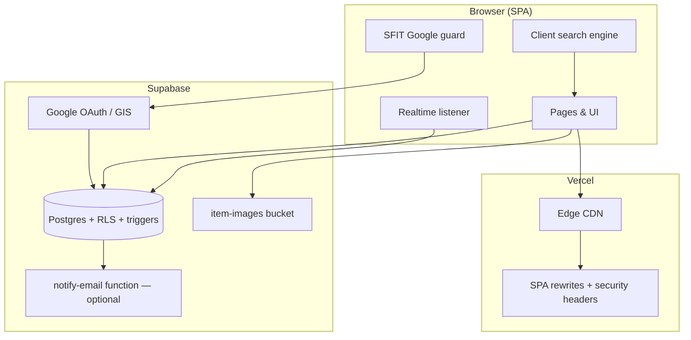

# CampusFind

Lost and found for St. Francis Institute of Technology.

CampusFind is a campus-only board for SFIT students and faculty. Sign in with a college Google account, post what you lost or found, and settle claims in private — without WhatsApp groups, phone numbers, or a public inbox.

---

## Why it exists

On campus, lost items still get posted as photos in batch WhatsApp groups. That works until it doesn't:

- A listing in a 1,000-person chat is buried in hours.
- You cannot search by "black wallet", "ID card", or "library".
- Phone numbers and profile photos go to strangers.
- The first person to DM can take the item. There is no proof step.
- After it is returned, the original message stays in the chat forever.

CampusFind is the board those groups were trying to be: indexed, private, and finished when the item comes home.

---

## How a return works

```
Post  →  Search  →  One private note  →  Accept or decline  →  Campus handover  →  Mark returned
```

1. **Post it** — Lost or found, same form. Title, place, a photo if you have one. If you found it, say whether it's **with you** or **left at a desk**.
2. **Find it** — Search the board. If you have someone's lost item, open that listing and tap **I found this**. If a found listing is yours, tap **This is mine**.
3. **Prove it** — One private note: a mark, a color, what's inside. Only the poster and the claimant can see it.
4. **Hand it back** — Accept with an optional campus meetup (library, canteen, quadrangle). Decline if the note is wrong. Meet in person. Mark it returned.

Listings show a **name**, not an email. Claims never appear on the public board.

---

## Product rules that actually ship

These are enforced in Postgres, not only in the UI.

- **College Google only.** Client, auth context, and a database trigger all reject non-SFIT domains. The domain lock can be toggled live via `app_settings.sfit_email_lock` without redeployment.
- **Lifecycle.** `lost` / `found` → `claimed` → `returned`. Soft-delete (`deleted_at`) keeps history without leaving junk on the board.
- **Claims.** One pending-or-resolved claim per user per item. You cannot claim your own listing. Accepting one claim closes the others and notifies those people.
- **Alerts.** A claim, accept, decline, withdraw, meetup change, return, or delete writes a notification **in Postgres** via a `SECURITY DEFINER` stored function. The bell updates over Supabase Realtime. Optional email via Resend if a key is configured.
- **Possible matches.** Posting a lost item can ping owners of similar found listings (and the other way around), same category, overlapping title tokens.
- **Photos.** Up to five images per listing (JPG, PNG, WebP, 5 MB each). Deleting a post removes the files from storage. Marking **returned** takes it off the board but keeps photos so you can reopen it.
- **Limits.** 10 new listings per 24 hours, 15 claims per 24 hours, 20 notifications per hour — enforced by Postgres triggers, not client-side checks.

---

## Stack

| Layer | Choice | Why |
|---|---|---|
| UI | React 18, TypeScript, Vite 5 (SWC) | Fast local loop, typed surfaces |
| Style | Tailwind CSS, Radix UI / shadcn | One design system, accessible primitives |
| Motion | Framer Motion, custom CSS spring curves | Smooth, physics-based micro-interactions |
| Data | Supabase Postgres + RLS + Storage | Auth, files, and policies in one place |
| Cache | TanStack Query v5 | Listings and inbox stay fresh without extra servers |
| Realtime | Supabase Realtime (postgres_changes) | Live notification bell with zero polling |
| Search | In-memory scorer (`search-engine.ts`) | Campus synonyms and typos, no Algolia bill |
| Hosting | Vercel Hobby | SPA rewrites and security headers at the edge |
| Cost | Free tiers | Built to stay at $0 for a ~3–4k campus |

---

## Architecture



The browser talks to Supabase through the publishable anon key. **Row Level Security** decides who can read a claim or a listing. **Triggers** write notifications, enforce rate limits, and block bad inserts even if a client is old or hostile.

---

## Security model

RLS is on for every table.

| Table | Public can see | Who can write |
|---|---|---|
| `profiles` | Display name and avatar | Owner only |
| `items` | Active lost/found listings | Owner; status changes are trigger-constrained |
| `item_images` | Images on active listings | Owner, within their own storage folder |
| `claims` | Nobody on the board | Poster and claimant only |
| `notifications` | Never public | Only via `create_notification()` stored function |
| `user_roles` | Hidden | Admin path only |

Notifications are not inserted from the client into the table. The claim row is saved first; a `SECURITY DEFINER` trigger notifies the other person. If the browser tab dies, the alert still exists.

---

## Interface highlights

The UI is built to feel like a finished campus product, not a dashboard template.

- **Light and dark themes**, persisted to `localStorage`, aligned to system preference.
- **Gooey search bar** — SVG metaball effect (`feGaussianBlur` + `feColorMatrix`) that expands fluidly on focus. Right-pinned so the pill never jumps.
- **Mobile dock** — iOS-style floating bar with drag tracking, squash-and-stretch physics, and spring snapping using `cubic-bezier(0.22, 1, 0.36, 1)`.
- **Dashboard inbox** — Apple Mail-grade triage queue with a fixed-height dual-panel frame, independent scrolling panels, and a 3-card inspection console (profile context, verification proof, handover console).
- **Claim lifecycle** — 3-stage progress rail (Submitted → Review → Handover) on every claim card.
- **Resolution notices** — When a listing is removed or concluded, the detail page renders a contextual Apple-style notice (Removed, Returned, Claimed, or Unavailable) instead of a blank "not found".
- **Skeleton loaders** for every data-dependent route; no layout shift on navigation.

---

## Repository structure

```text
src/
  App.tsx                  Shell — providers, routes, lazy page imports
  components/
    common/                ErrorBoundary, AuthPromptModal, GlowAction, Skeletons,
                           PageTransition, NetworkStatusNotifier
    layout/                Navbar, MobileDock, Footer, LegalLayout
    ui/                    ~50 shadcn/Radix UI primitives
  constants/               CATEGORIES, LOCATIONS, STATUS_STYLES, CATEGORY_STYLES
  contexts/                AuthContext, ThemeContext, AuthPromptContext
  features/items/
    components/            ClaimModal, GooeySearchBar, ItemCard, SearchFilters
    services/itemsApi.ts   All public-board data fetching via Postgres RPCs
    types.ts               ItemWithImage, RawItem, ItemFilters, ItemStatus
    utils/
      search-engine.ts     In-memory ranking: synonyms, stemming, Levenshtein fuzzy
      item-filters.ts      URLSearchParams serialization helpers
      item-validation.ts   File type/size checks, claim text validation
  hooks/                   use-notification-realtime, use-mobile, use-sfit-email-lock
  integrations/supabase/   Supabase JS client + generated TypeScript types
  lib/                     email.ts, google-gis.ts, utils.ts (cn()), notification-routing.ts
  pages/                   Index, Items, ItemDetail, PostItem, Dashboard,
                           Auth, FAQ, Privacy, Terms, NotFound
  services/notifications.ts  Desktop push, notifyUser RPC wrapper
  test/                    Vitest suites for email, search, filters, validation, realtime routing
  types/database.ts        DBItem, DBClaim, DBNotification, DashboardData

supabase/
  migrations/              19 sequential PostgreSQL migrations
  functions/notify-email/  Optional Deno edge function for Resend email delivery
```

---

## Local setup

**Needs:** Node 18+, a Supabase project, a Google OAuth web client restricted to the SFIT domains.

```bash
git clone https://github.com/kencoelhoo-source/CampusFind.git
cd CampusFind
npm install
```

`.env` in the project root:

```env
VITE_SUPABASE_URL=https://your-project-id.supabase.co
VITE_SUPABASE_PUBLISHABLE_KEY=your-supabase-anon-key
VITE_GOOGLE_CLIENT_ID=your-google-oauth-client-id.apps.googleusercontent.com
```

> `VITE_SUPABASE_PUBLISHABLE_KEY` is the public anon key, fully governed by RLS. Never put the `service_role` secret in this repo.

Apply every file in `supabase/migrations/` in order (SQL editor or Supabase CLI), then:

```bash
npm run dev
```

App: `http://127.0.0.1:8080`

Optional email (in-app alerts work without this):

```text
RESEND_API_KEY=re_...
RESEND_FROM_EMAIL=CampusFind <alerts@your-domain>
SITE_URL=https://your-deployment
```

Deploy the `supabase/functions/notify-email` function and set those as Supabase secrets.

---

## Tests

```bash
npm test           # full unit suite
npm run test:watch # interactive watch mode
npm run lint       # ESLint
npm run build      # production bundle check
```

Coverage includes SFIT email domain rejection, search engine scoring and synonym expansion, image/claim validators, URL filter serialization, notification routing (inbox vs claims vs match links), and realtime channel wiring.

---

## Cost

Designed to run on free tiers for a college the size of SFIT.

| Service | Plan | Role |
|---|---|---|
| Supabase | Free | Auth, Postgres, Storage, Realtime |
| Vercel | Hobby | Hosting and edge security headers |
| Google Identity | Free (GCP) | College sign-in via GIS + OAuth |
| Search | None | Runs in the browser |
| Resend | Optional free tier | Email copies of in-app alerts |

No Algolia, Twilio, or required email vendor. If Resend is not configured, claims still notify inside the app.

---

## Campus

Built for **St. Francis Institute of Technology**, Mount Poinsur, Borivali (West), Mumbai.

CampusFind is a student-built board. It does not replace the college lost-and-found desk or campus security for high-value or sensitive items.

Designed and maintained by Ken Coelho.
