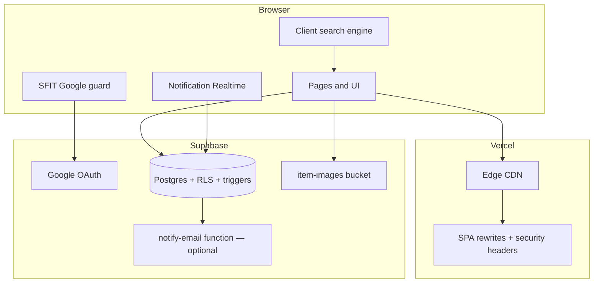

# CampusFind

Lost and found for St. Francis Institute of Technology.

CampusFind is a campus-only board for SFIT students and faculty. Sign in with a college Google account, post what you lost or found, and settle claims in private — without WhatsApp groups, phone numbers, or a public inbox.

---

## Why it exists

On campus, lost items still get posted as photos in batch WhatsApp groups. That works until it doesn’t:

- A listing in a 1,000-person chat is buried in hours.
- You cannot search by “black wallet”, “ID card”, or “library”.
- Phone numbers and profile photos go to strangers.
- The first person to DM can take the item. There is no proof step.
- After it is returned, the original message stays in the chat forever.

CampusFind is the board those groups were trying to be: indexed, private, and finished when the item comes home.

---

## How a return works

```
Post  →  Search  →  One private note  →  Accept or decline  →  Campus handover  →  Mark returned
```

1. **Post it** — Lost or found, same form. Title, place, a photo if you have one. If you found it, say whether it’s **with you** or **left at a desk**.
2. **Find it** — Search the board. If you have someone’s lost item, open that listing and tap **I found this**. If a found listing is yours, tap **This is mine**.
3. **Prove it** — One private note: a mark, a color, what’s inside. Only the poster and the claimant can see it.
4. **Hand it back** — Accept with an optional public meetup (library, canteen, quadrangle). Decline if the note is wrong. Meet in person. Mark it returned.

Listings show a **name**, not an email. Claims never appear on the public board.

---

## Compared with group chats

| | WhatsApp groups | CampusFind |
|---|---|---|
| Who can join | Anyone with the invite | `@student.sfit.ac.in` and `@sfit.ac.in` only |
| Contact | Phone numbers in the chat | Name on the listing; email never public |
| Search | Scroll | Title, description, place, category, campus synonyms, typo tolerance |
| Proof | First DM wins | Private claim, accept or decline |
| After it is returned | Message stays in the group | Status becomes `returned`; listing leaves the public board |
| Abuse | Admin after the fact | Database rate limits, one claim per person per item, no self-claims |

---

## Product rules that actually ship

These are enforced in Postgres, not only in the UI.

- **College Google only.** Client, auth context, and a database trigger all reject non-SFIT domains.
- **Lifecycle.** `lost` / `found` → `claimed` → `returned`. Soft-delete (`deleted_at`) keeps history without leaving junk on the board.
- **Claims.** One pending-or-resolved claim per user per item. You cannot claim your own listing. Accepting one claim closes the others and tells those people.
- **Alerts.** A claim, accept, decline, withdraw, meetup change, return, or delete writes a notification **in the same database transaction** as the action. The bell updates over Supabase Realtime. Optional email via Resend if a key is configured.
- **Possible matches.** Posting a lost item can ping owners of similar found listings (and the other way around), same category, overlapping title tokens.
- **Photos.** Up to five images per listing (JPG, PNG, WebP, 5 MB). Deleting a post removes the files from storage. Marking **returned** takes it off the board but keeps photos so you can reopen it.
- **Limits.** 5 new listings per hour, 15 claims per 24 hours, 20 notifications per hour.

---

## Stack

| Layer | Choice | Why |
|---|---|---|
| UI | React 18, TypeScript, Vite 5 (SWC) | Fast local loop, typed surfaces |
| Style | Tailwind CSS, Radix / shadcn | One design system, accessible primitives |
| Data | Supabase Postgres + RLS + Storage | Auth, files, and policies in one place |
| Cache | TanStack Query v5 | Listings and inbox stay fresh without extra servers |
| Search | In-memory scorer (`search-engine.ts`) | Campus synonyms and typos, no Algolia bill |
| Hosting | Vercel | SPA rewrites and security headers at the edge |
| Cost | Free tiers | Built to stay at $0 for a ~3–4k campus |

---

## SEO & Discovery

CampusFind is highly optimized for search engines, web performance, and AI indexing:

- **Metadata**: Includes Open Graph tags, canonical links, and Schema.org JSON-LD structured data.
- **Performance**: Heavy static assets (like campus photography) are compressed and served as WebP, drastically reducing bundle size.
- **AI Readiness**: An `llms.txt` file and optimized `robots.txt` guide AI agents (like ChatGPT Search and Perplexity) on how to index the platform while protecting private user routes.
- **PWA**: Includes a standard `site.webmanifest` and `apple-touch-icon.png` for installing to iOS and Android home screens.

---

## Architecture



The browser talks to Supabase through the publishable key. **Row Level Security** decides who can read a claim or a listing. **Triggers** write notifications, close sibling claims, and block bad inserts even if a client is old or hostile.

---

## Security model

RLS is on for every table.

| Table | Public can see | Who can write |
|---|---|---|
| `profiles` | Display name | Owner only |
| `items` | Active lost/found listings | Owner; status changes are constrained |
| `item_images` | Images on active listings | Owner, with storage rules |
| `claims` | Nobody on the board | Poster and claimant only |
| `notifications` | Never public | Inserts only through `deliver_notification` / `create_notification` |
| `user_roles` | — | Admin path only |

Notifications are not inserted from the client into the table. The claim row is saved first; a `SECURITY DEFINER` trigger notifies the other person. If the browser tab dies, the alert still exists.

---

## Interface

The UI is built to feel like a finished campus product, not a dashboard template.

- Light and dark themes, persisted, aligned to system preference.
- Hero search uses an SVG metaball (`feGaussianBlur` + `feColorMatrix`). The search drop is **right-pinned** so width is the only thing that moves — no end-of-animation jump on the pill or the arrow.
- Mobile dock is an iOS-style floating bar with drag tracking.
- Home CTA is one landscape from “Built only for SFIT” through the footer, with separate art for desktop/mobile and light/dark.

---

## Repository

```text
src/
  components/          Layout, dock, shared UI
  features/items/      Listings, claims, search, validators
  hooks/               Realtime notifications, mobile
  integrations/        Supabase client and types
  pages/               Routes
  services/            Notification helpers
  test/                Vitest suites
supabase/
  migrations/          Schema, RLS, triggers
  functions/           Optional notify-email
```

---

## Local setup

**Needs:** Node 18+, a Supabase project, a Google OAuth web client restricted to the SFIT domains.

```bash
git clone https://github.com/kencoelhoo-source/CampusFind.git
cd CampusFind
npm install
```

`.env` in the project root:

```env
VITE_SUPABASE_URL=https://your-project-id.supabase.co
VITE_SUPABASE_PUBLISHABLE_KEY=your-supabase-publishable-key
VITE_GOOGLE_CLIENT_ID=your-google-oauth-client-id.apps.googleusercontent.com
```

Apply every file in `supabase/migrations/` (SQL editor or Supabase CLI), then:

```bash
npm run dev
```

App: `http://127.0.0.1:8080`.

Optional email (in-app alerts work without this):

```text
RESEND_API_KEY=re_...
RESEND_FROM_EMAIL=CampusFind <alerts@your-domain>
SITE_URL=https://your-deployment
```

Deploy the `notify-email` function and set those as Supabase secrets.

---

## Tests

```bash
npm test          # unit suite
npm run test:watch
npm run lint
npm run build
```

Coverage includes SFIT email rejection, search scoring and synonyms, image/claim validators, filters, and notification routing (inbox vs claims vs match links).

---

## Cost

Designed to run on free tiers for a college the size of SFIT.

| Service | Plan | Role |
|---|---|---|
| Supabase | Free | Auth, Postgres, storage |
| Vercel | Hobby | Hosting and headers |
| Google Identity | Free | College sign-in |
| Search | None | Runs in the browser |
| Resend | Optional free tier | Email copies of alerts |

No Algolia, Twilio, or required email vendor. If Resend is unset, claims still notify inside the app.

---

## Campus

Built for **St. Francis Institute of Technology**, Mount Poinsur, Borivali (West), Mumbai.

CampusFind is a student-built board. It does not replace the college lost-and-found desk or campus security for high-value or sensitive items.

Designed and maintained by Ken Coelho.
